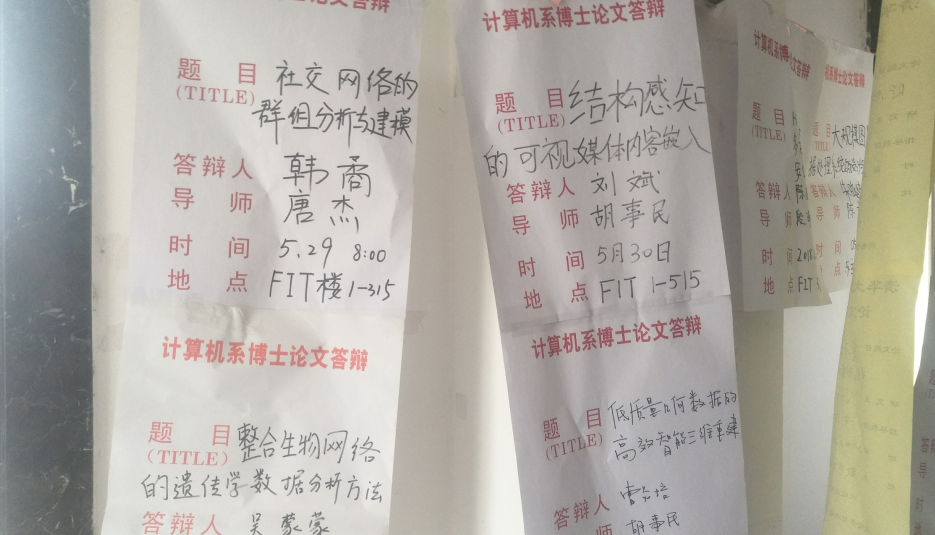
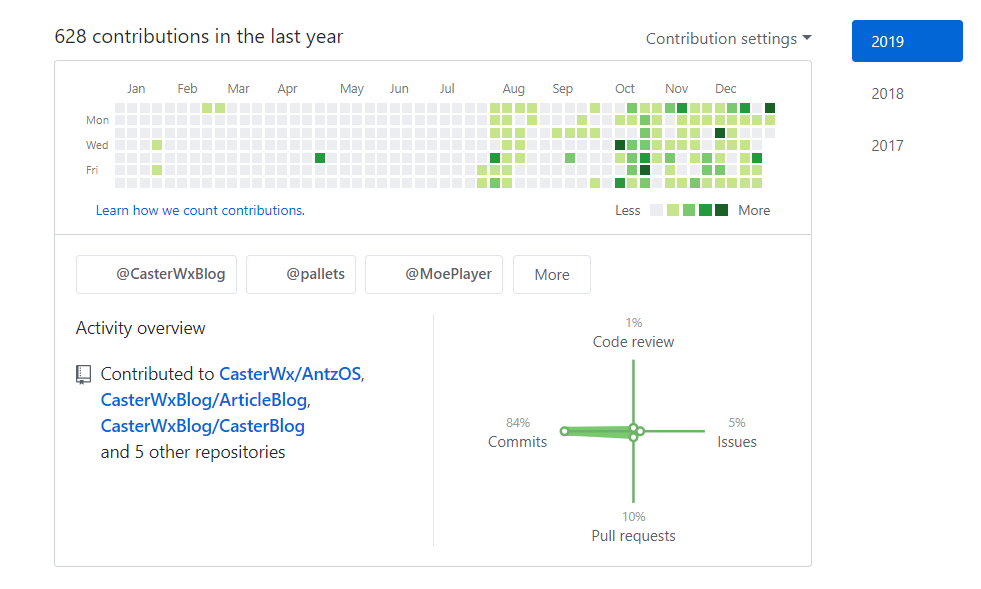

# 2018 年终总结

> 2018，无所事事又带点丧的一年，感觉很对不起 <del>17</del> <del>18</del> 20岁这个年纪，要跟自己说声对不起了

## 足迹

* 绿博园
* 奥林匹克公园
* 故宫

* IBM
* 清华校园

* 中矿大

* 清明上河园
* 黄河滩
* 腊子口

去了很多地方，却没意识到今年一次都没出去旅游过，2019 要好好制定一下出行计划了，想去日本看樱花 🌸，想去泉州体验`室友Y`说的`包吃包住`，想回南部体验一下新家，然后去成都蹦极。

## 开源

* 今年 7 月开坑了 AntzOS(Antz操作系统) ，让自己学到了很多东西，认识了很多人，算是今年为数不多的有趣的事情之一了。

* python-girlfriend-mood(女友情绪分析)吸引了我绝大多数现在的Follower和star,算是今年意料之外的项目了。

* c-cPlusPlus-Virus(病毒),本想做一个病毒分析的Demo,成品发布出去之后没想到有一堆计算机类的同学中枪。[传说中抢不上毛概二的人]

* BitQR-Code一个2018年初开的坑,到了年末想起来填上，电脑义诊群里看到有人问怎么做动态二维码，才想起来自己还有一个BitQR-Code的坑。

* Spider,这个应该算是从2017年的项目,不过具体完善都已经是2018年6月左右了,后来参加了Github上第一的爬虫项目awesome-spider,以至于JavaWeb老师看了我的博客之后完全没有意识到我其他的项目,就认为我爬虫写的很好。

2019 期望再开一个 LTS 一年以上的坑，暂时还没什么想法 🤯 八月开始挂在开源社区里的微信支付宝赞助码累计收到270元(全是Android方面的)赞助，虽然看起来不多，虽然他们赞助之后都是让我帮忙改Bug，但是想到居然除了在学校帮同学修电脑改Bug混吃混喝还可以在开源社区混吃混喝:trollface:

## 技能

🎨 画画：看见盒子精画画那么菜每天都在坚持画画，下半年我也重拾了高中放下的画笔，画画真好玩，可惜没什么想画的了，就没能坚持下来，2019 再给我一个画画的动力吧

🍛 做饭：在家的时候会搭配一些奇怪的调料在饭里，感觉还很香

🎃 调音：从大一开始被`他城`骗去学VOCALOID，开始一直以为她是学计算机的

## 游戏

LOL练得一手无敌强中单泽拉斯，但是无耐每次KD来开封，看电影前要惯例给我火男辅助，下路一打三果然很难。不过每年20天的无限火力结束之后一般就卸游戏了。

堡垒之夜、中国式家长、王者荣耀、剑侠情缘、绝地求生也稍微玩了一下下

> <del>说起游戏突然想起来暑假本来想做一个2D魔法世界的小游戏，做完新手村就忘了这档事了。</del>

## 影视

电影：

* 复仇者联盟3
* 王牌特工2
* 昆池岩
* 碟中谍6
* 蚁人2
* 雷神3：诸神黄昏
* 蜘蛛侠：英雄归来
* 黑豹
* 天才枪手
* 环太平洋2
* 银河护卫队2
* 太多了，略过

番剧：

* 《青春猪头少年不会梦到兔女郎学姐》
* 《工作细胞》
* 《路人女主的养成方法》
* 《OVERLORD》
* 《中二病也要谈恋爱！》
* 《超能力女儿》
* 《关于我转生变成史莱姆这档事》
* 《刀剑神域 Alicization》
* 《迷茫管家与懦弱的我》
* 《紫罗兰永恒花园》
* 《笨女孩》
* 《月刊少女野崎君》
* 《Fate/Apocrypha》
* 《徒然喜欢你》
* 《宅男腐女恋爱真难》
* 《我女友与青梅竹马的惨烈修罗场》
* 《野良神》
* 《皇帝圣印战记》
* 《龙王的工作！》
* 《埃罗芒阿老师》
* 《男子高中生的日常》

## 健康

体重没减下来，增加一点点(但怀疑是电子秤不准)

早睡：大失败

2019 想把头顶染成黑色假装头发很多 👩‍

## 情感

:see_no_evil: 又是单身的一年，`室友G`在我的帮助下<del>脱发</del>脱单后对我进行了`日复一日`的`嘲讽`。

后来同学看到我首页上`薇尔丽特老公`的信息后国庆送给我一个薇尔丽特的手办，从此我彻底被打上了肥宅的标签。

<del>但怎么说也是有老婆了(哪怕只是手办)。</del>

## 博客

2018年博客累计92篇，主要为`Java`方面的，专题有`数据分析`和`AntzOs`。被慕课小编拉去在慕课做认证作者，不过到现在一篇都没写过，还有阿里云栖的小编给的阿里专家认证，因为云栖没有自动登录的功能，每次还得重新登录一下账号，实在受不了就没再登过了。

博客里留QQ真的会有很多人加，但全是找改BUG的。:scream_cat: (当然还有女粉~逃)

## 最后

:squirrel: 2019 希望可以活得更认真一点，尽量让自己变得充实有趣起来，但说实话我也没什么信心，Github一定要刷到全绿，博客也要认真更新(`好像有点难`)