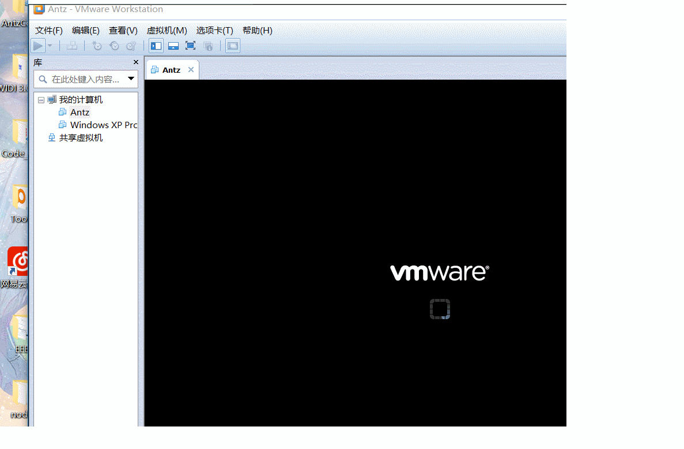
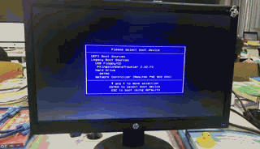

# AntzOs

> 一个从零开始的自制操作系统

开发文档及记录。
[https://www.cnblogs.com/LexMoon/category/1262287.html](https://www.cnblogs.com/LexMoon/category/1262287.html)

#### 制作启动动画

图片来源 : [phodal/daily](https://github.com/phodal/daily)

#### 真机运行

#### 显卡的直接操作

#### 进程与时钟

#### vim

#### [Antz系统更新地址](https://www.cnblogs.com/LexMoon/category/1262287.html)

#### [Github项目地址](https://github.com/CasterWx/AntzOS)

#### 早期真机运行情况 ：

这个系统在我最初的目的中就是实现一个半图形半终端的轻巧OS。

完成了当前的工作后，Antz接下来需要实现的则是关于任务调度相关的。

目前实现的是在Terminal中对命令的响应，还有一个简易的vim，可以用于右边界面的文本编辑。

对于按键中断，对全键盘的响应改良之后不会出现之前说的bug，但是在shift按下时的按键模式却是有很大问题，虽然我已经想到了解决方案，不外乎给shift的按下一个flag，弹起一个flag，但这部分感觉现在实现与否都是不怎么重要，所以就先忽略这里了。

最近同时也在读Linux内核源码。发现其中的注释也是很有意思，甚至Linus自己写的，他也不知道这部分为什么这样写，不断尝试之后发现可以实现，他就这样用了。

目前的项目目录，请忽略掉md文件，这个镜像文件可以直接使用工具写入u盘启动，或者在虚拟机打开。thun.c新增的，目的是为了抽离其他c文件中的工具化函数，不然以后只是一个源码文件都会让人头疼。

[AntzOs](https://github.com/CasterWx/AntzOS)需要更多优秀的开发者来实现，无论你是正在学习操作系统课程还是其他方面，我相信AntzOs都可以帮助你更加的深入了解计算机操作系统底层的实现。

## 赞助

| 支付宝 | 微信 |
| ------------ | ------------ |
|  | |

| 鸣谢列表 | 备注 |
| ------- | -------- |
| [@小橙子](https://weibo.com/u/2068007951) | 赞助￥1 |
| @Yyh | 赞助书籍《Linux内核源码刨析》,《深入理解Linux内核》等四本实体书 |

所有项目都是完全开源的，使用完全免费。 但是如果您对此项目有兴趣，可以通过赞助的方式来支持。您可以通过扫码的方法来赞助开发。您的名字会出现在我的GitHub仓库和博客文档中。
