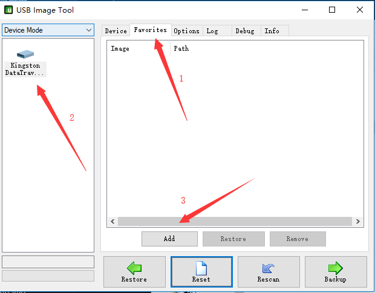
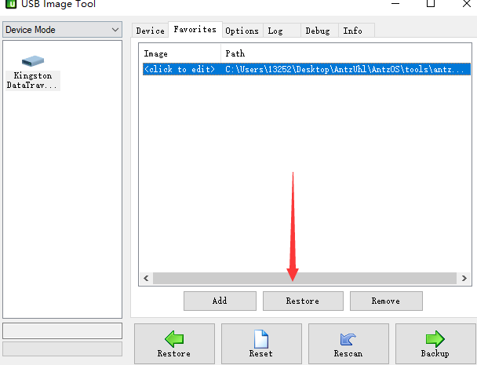



系统封面授权取自于[phodal](https://github.com/phodal/daily)。

# AntzOS

> 一个随心所欲制造的操作系统Antz。

The goal is to build a very simple UNIX-based operating system in c, not just a "proof-of-concept". The OS should be able to boot, start a userland shell, and be extensible.

#### 开发文档

[https://www.cnblogs.com/LexMoon/category/1262287.html](https://www.cnblogs.com/LexMoon/category/1262287.html)

1. [主引导Boot Sector](https://www.cnblogs.com/LexMoon/p/antz01.html)
2. [进入保护模式](https://www.cnblogs.com/LexMoon/p/antz02.html)
3. [直接操作显存](https://www.cnblogs.com/LexMoon/p/antz03.html)
4. [从硬盘载入内核](https://www.cnblogs.com/LexMoon/p/antz04.html)
5. [深入理解保护模式与进入方法](https://www.cnblogs.com/LexMoon/p/antz05.html)
6. [内核1](https://www.cnblogs.com/LexMoon/p/antz06.html)
7. [内核2](https://www.cnblogs.com/LexMoon/p/antz07.html)
8. [内核扩展](https://www.cnblogs.com/LexMoon/p/antz08.html)
9. [实现图形化界面](https://www.cnblogs.com/LexMoon/p/antz09.html)
10. [实现shell](https://www.cnblogs.com/LexMoon/p/antz10.html)
11. [命令响应](https://www.cnblogs.com/LexMoon/p/antz11.html)
12. [显示图片](https://www.cnblogs.com/LexMoon/p/antz13.html)
13. [实现内置语言词法解析器](https://www.cnblogs.com/LexMoon/p/antz14.html)
14. 实现启动动画

#### 环境搭建

`makefile` + `gcc` + `dd`  ; `Windows下dd可直接使用exe版本的。`

为了方便测试建议使用虚拟机。

#### 快速开始/如何使用

1. 下载仓库内tools包中的`USB Image Tool`启动盘制作工具与`antz.img`镜像文件。
2. 准备一个空闲的U盘。
3. 按照下述图示。

| 1 | 2 | 3 |
| ------- | -------- | -------- |
|  |  |  |

#### 效果演示

| 制作启动动画 [图片来源:phodal/daily](https://github.com/phodal/daily) | 真机运行 |
| ------- | -------- |
|  |  |
| 显卡的直接操作 | 进程与时钟 |
|  |  |

| vim |
| ------- |
|  |

#### 介绍

这个系统在我最初的目的中是一个半图形半终端的轻巧OS。

完成了当前的工作后，Antz接下来需要实现的则是关于任务调度相关的。

目前实现的是在Terminal中对命令的响应，还有一个简易的vim，可以用于右边界面的文本编辑。

对于按键中断，对全键盘的响应改良之后不会出现之前说的bug，但是在shift按下时的按键模式却是有很大问题，虽然我已经想到了解决方案，不外乎给shift的按下一个flag，弹起一个flag，但这部分感觉现在实现与否都是不怎么重要，所以就先忽略这里了。

最近同时也在读Linux内核源码。发现其中的注释也是很有意思，甚至Linus自己写的，他也不知道这部分为什么这样写，不断尝试之后发现可以实现，他就这样用了。

这个镜像文件可以直接使用工具写入u盘启动，或者在虚拟机打开。

[AntzOs](https://github.com/CasterWx/AntzOS)需要更多优秀的开发者来实现，无论你是正在学习操作系统课程还是其他方面，我相信AntzOs都可以帮助你更加的深入了解计算机操作系统底层的实现。

| 历史版本1 | 历史版本2 | 历史版本3 |
| ------- | ------- | ------- |
|  |  |  |

#### 交流群

Telegram : [https://t.me/antzuhl/](https://t.me/antzuhl/)
